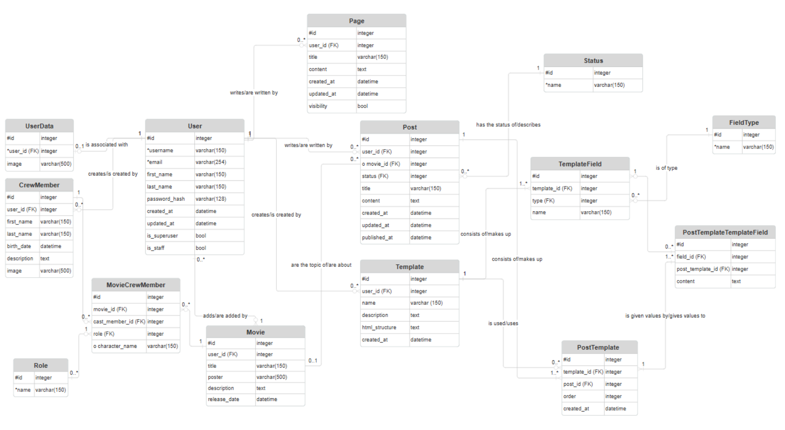
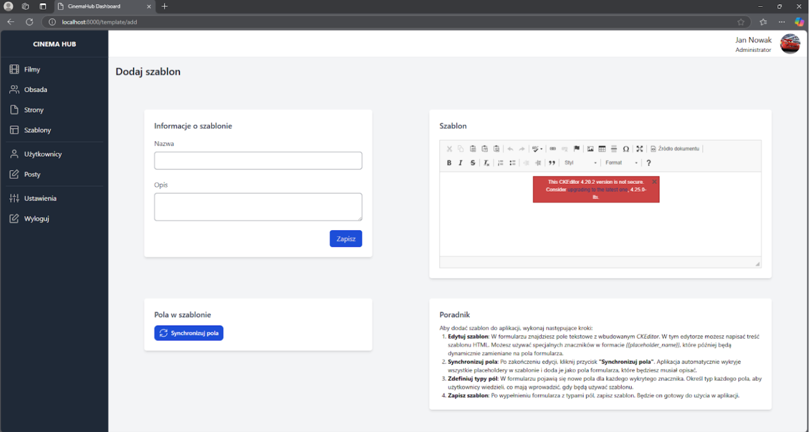
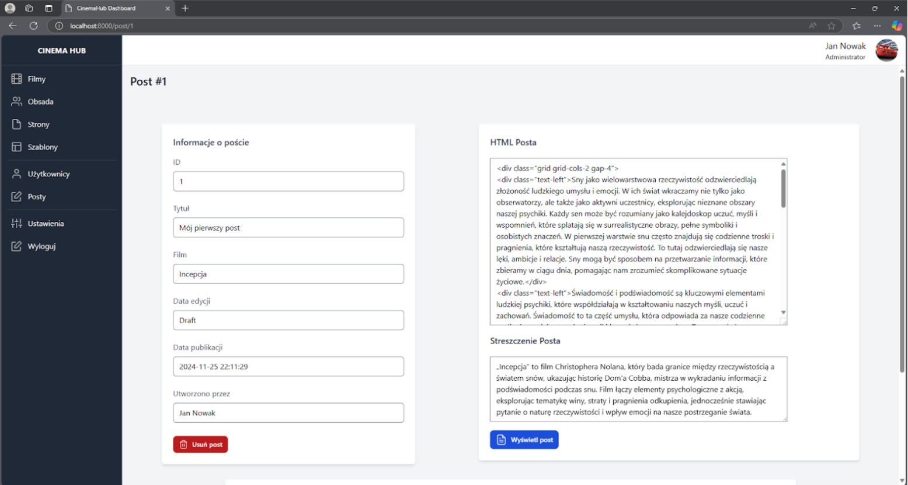
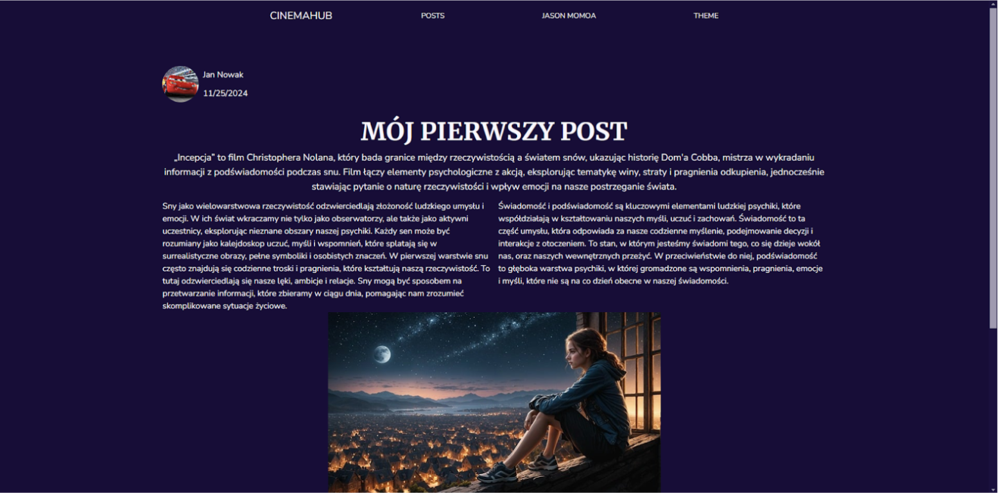

# 🎬 CinemaHub – Backend & Admin Panel

**CinemaHub** is a platform built for movie enthusiasts 🎥. This repository includes the backend system developed in Django, with a fully functional REST API and a powerful admin panel for managing blog content and a movie database.

---

## 📦 Repository Contents

This repository contains:
- Django-based backend logic
- REST API for user blogs, movies, templates, and user profiles
- Custom Admin Panel for content management and moderation

👉 The client-facing frontend (built with Svelte) is located in a separate [repository](https://github.com/jedrzej-gorski/sveltekit-landing-daisy).

---

## 🛠️ Tech Stack

- Python 3.11+
- Django 4.x
- Django REST Framework (DRF)
- SQLite (can be easily migrated to PostgreSQL)
- Bootstrap (for the admin panel UI)

---

## ⚙️ Features

### User Features:
- Register & login (JWT-based)
- Create and edit posts using customizable templates
- Browse blogs, posts, and movies
- Upload personal images, edit profile info

### Admin Features:
- Manage movies, cast, and categories
- Create custom static pages (e.g. privacy policy)
- Restrict misbehaving users
- View and manage all user accounts and content

---

## 🧩 System Architecture

CinemaHub is divided into 3 main components:

- 🧠 **Backend (Django)** – core logic and API
- 🌐 **Frontend (Svelte)** – public-facing blog UI *(external)*
- 🛡️ **Admin Panel (Django Admin)** – content and user management

---

## 🗃️ Database Overview (Key Models)

- `User`, `UserData` – user profile and image handling
- `Post`, `Template`, `TemplateField` – structured content via templates
- `Movie`, `CrewMember`, `Role` – rich movie and cast management
- `Page` – dynamic static pages managed by admins


---

## 🔐 Authentication

All protected endpoints require **JWT tokens**. After a successful login, the token must be provided in the `Authorization` header for future requests.

---

## 📡 Sample API Endpoints

- `POST /api/auth` – login
- `GET /api/user/current/` – fetch current user details
- `POST /api/post/` – create new post
- `GET /api/movies/?category=Thriller&director_id=5` – filter movies
- `GET /api/templates/` – fetch available post templates

📄 Full API is described in the [technical documentation](https://docs.google.com/document/d/1jldDyfMLo86742EcsTbsRZZs7AO1JpYRaGkWEGdNtmg/edit?usp=sharing).

---

## ▶️ Getting Started

```bash
git clone https://github.com/321nomyzS/CinemaHub.git
cd CinemaHub
pip install -r requirements.txt
python manage.py runserver
```

## 🖼️ Screenshots


